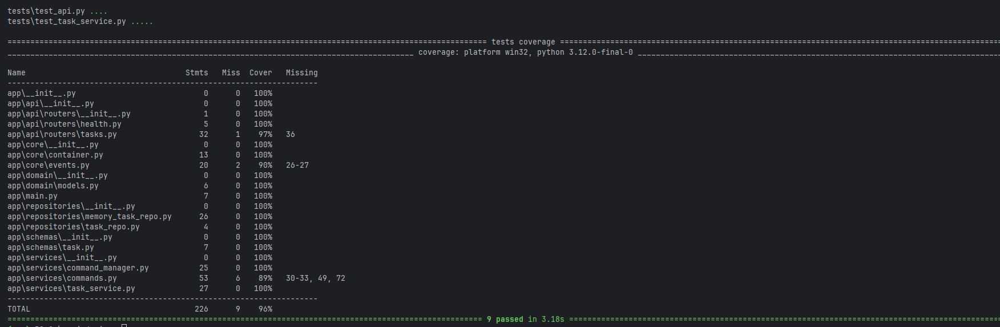

# Tasky API — FastAPI, SOLID & Design Patterns (Command + Observer)

Tasky API is a small FastAPI application (mini task manager) designed to demonstrate:
- clean **layered architecture**
- correct application of **SOLID principles**
- practical usage of two **behavioral design patterns**:
  - **Command**
  - **Observer**

The application exposes a minimal REST API that allows managing tasks and supports **undo / redo** functionality.

---

## Features
- `GET /tasks` — list all tasks
- `POST /tasks` — create a new task
- `POST /tasks/{id}/complete` — mark task as completed
- `DELETE /tasks/{id}` — delete task
- `POST /tasks/undo` — undo last action
- `POST /tasks/redo` — redo last undone action

Swagger UI:
`http://127.0.0.1:8000/docs`

---

## Technology Stack
- Python 3.9+
- FastAPI
- Uvicorn
- Pytest

---

## Design Patterns Used

## 1. Command Pattern (Behavioral)

### Why Command?
The application supports actions that must be reversible:
- add task
- complete task
- delete task

Implementing undo/redo directly inside services or controllers would lead to complex, tightly coupled logic.

### What problem does it solve?
Command pattern encapsulates each user action in a separate object that knows:
- how to execute itself (`execute`)
- how to reverse itself (`undo`)

This allows:
- generic undo/redo support
- clean history management
- easy extensibility

### Where is it implemented?
- `app/services/commands.py`
  - `AddTaskCommand`
  - `DeleteTaskCommand`
  - `CompleteTaskCommand`
- `app/services/command_manager.py`
  - `CommandManager` maintains undo and redo stacks
- `app/services/task_service.py`
  - orchestrates command execution via `CommandManager`

### Undo / Redo mechanism (conceptual)
- Each executed command is pushed onto an **undo stack**
- Calling undo:
  - pops the last command from undo stack
  - calls its `undo()` method
  - pushes it onto the redo stack
- Calling redo:
  - pops the command from redo stack
  - re-executes it
  - pushes it back onto undo stack

---

## 2. Observer Pattern (Behavioral)

### Why Observer?
In real applications, state changes often require side effects:
- logging
- notifications
- auditing
- metrics collection

Embedding such logic directly into services would violate SRP and create tight coupling.

### What problem does it solve?
Observer pattern decouples **business logic** from **side effects**.
Core logic emits events, while observers react to those events independently.

### Where is it implemented?
- `app/core/events.py`
  - `EventBus` (Subject)
  - `ConsoleObserver` (Observer)
- Wired together in:
  - `app/core/container.py`

### How is it used?
When a command modifies application state, it emits events such as:
- `task_added`
- `task_completed`
- `task_deleted`
- `task_restored`

Observers subscribed to the `EventBus` receive and handle these events without the core logic being aware of them.

---

--- 
## 🧪 Testing

The project uses **pytest** for automated testing and **pytest-cov**...

### Running the Tests
To run all tests in quiet mode:
` ` `bash
pytest -q 
` ` `



---


## Running the Application

```bash
pip install -r requirements.txt
python -m uvicorn app.main:app --reload

